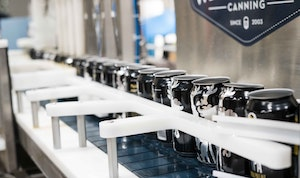

# Azure IoT Workshop: Quality assurance for soda can manufacturing company Fabrikam

## Introduction and Scenario

Fabrikam is a company that manufactures soda cans. As part of their quality assurance process, they need to make sure that the cans stay upright at all times as they move through different conveyor belts. Misplaced or fallen over cans can not only slow down their production lines but also decrease the overall quality of their products (ex. during the label printing phase). Fabrikam currently runs three production lines in parallel, each producing hundreds of cans per minute.

Fabrikam already has monitoring cameras in place that human operators use to perform real-time visual inspection of the production lines. They anticipate great efficiency and quality improvements if they could start automating the process.

## Fabrikam's requirements in a nutshell

- **Process video streams directly at the edge**, in their facility. They need to be able to detect anomalies fast in order to take action, and can’t afford the latency a cloud-based computer vision service would provide ;
- **Detect anomalies**, ex. alert operators when cans have tipped over ;
- **Process multiple & heterogeneous video streams**, since they have several production lines, each using different models of monitoring cameras ;
- **Manage their equipment remotely**, ex. as their processes evolve and improve over time, they need to be able to deploy updates such as new computer vision models to detect new kinds of anomalies.

## Outline

In this workshop, you will be building Fabrikam's real-time, AI-powered, quality assurance solution. 

To satisfy the real-time, multiple cameras, custom AI model requirements, we'll build this solution using [NVIDIA Deepstream](https://developer.nvidia.com/deepstream-sdk) on an [NVIDIA Jetson Nano device](https://developer.nvidia.com/embedded/buy/jetson-nano-devkit).

We'll build our own AI model with [Azure Custom Vision](https://www.customvision.ai/). We'll deploy and connect it to the Cloud with [Azure IoT Edge](https://azure.microsoft.com/en-us/services/iot-edge/) and [Azure IoT Central](https://azure.microsoft.com/en-us/services/iot-central/). Azure IoT Central will be used to do the monitoring and alerting.

1. [Setting up an NVIDIA Jetson Nano and installing Azure IoT Edge](step-001-setting-up-iot-edge/)
2. [Setting up an IoT Central application for video analytics](step-002-provisioning-iot-central-app/)
3. [Remotely operating the solution](step-003-remotely-operating/)
4. [Training and deploying a custom AI model for detecting visual anomalies](step-004-train-and-deploy-vision-ai/)
5. [Sending alerts](step-005-sending-alerts/)

## Supporting slide deck

No supporting slide deck is available at the time of writing.

## Contributing

This project welcomes contributions and suggestions.  Most contributions require you to agree to a
Contributor License Agreement (CLA) declaring that you have the right to, and actually do, grant us
the rights to use your contribution. For details, visit [https://cla.opensource.microsoft.com](https://cla.opensource.microsoft.com).

When you submit a pull request, a CLA bot will automatically determine whether you need to provide
a CLA and decorate the PR appropriately (e.g., status check, comment). Simply follow the instructions
provided by the bot. You will only need to do this once across all repos using our CLA.

This project has adopted the [Microsoft Open Source Code of Conduct](https://opensource.microsoft.com/codeofconduct/).
For more information see the [Code of Conduct FAQ](https://opensource.microsoft.com/codeofconduct/faq/) or
contact [opencode@microsoft.com](mailto:opencode@microsoft.com) with any additional questions or comments.

## Legal Notices

Microsoft and any contributors grant you a license to the Microsoft documentation and other content
in this repository under the [Creative Commons Attribution 4.0 International Public License](https://creativecommons.org/licenses/by/4.0/legalcode),
see the [LICENSE](LICENSE) file, and grant you a license to any code in the repository under the [MIT License](https://opensource.org/licenses/MIT), see the
[LICENSE-CODE](LICENSE-CODE) file.

Microsoft, Windows, Microsoft Azure and/or other Microsoft products and services referenced in the documentation
may be either trademarks or registered trademarks of Microsoft in the United States and/or other countries.
The licenses for this project do not grant you rights to use any Microsoft names, logos, or trademarks.
Microsoft's general trademark guidelines can be found at [http://go.microsoft.com/fwlink/?LinkID=254653](http://go.microsoft.com/fwlink/?LinkID=254653).

Privacy information can be found at [https://privacy.microsoft.com/en-us/](https://privacy.microsoft.com/en-us/)

Microsoft and any contributors reserve all other rights, whether under their respective copyrights, patents,
or trademarks, whether by implication, estoppel or otherwise.
