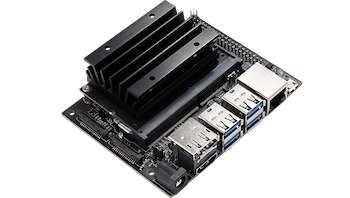

# Jetson Nano and Azure IoT Edge initial setup <!-- omit in toc -->

If you are attending a proctored lab, there are good chances that this step has already been taken care of for you, and that you have a Jetson Nano in front of you for which the following steps have already been performed. If not, read on to learn how to prepare a Jetson Nano for Azure IoT Edge development. 

We'll start from a blank Jetson installation (Jetpack v4.3 at the time of writing), install [JetCard](https://github.com/NVIDIA-AI-IOT/jetcard) (a set of tools from NVIDIA to help enrich your AI development experience on Jetson Nano), copy a few files that are needed for the application (ex. pre-recorded video files to simulate RTSP cameras, configuration files, …), and finally install Azure IoT Edge.

## Learning goals <!-- omit in toc -->

- How to perform the initial setup of an NVIDIA Jetson Nano device.
- How to install Azure IoT Edge on a Linux (Ubuntu) system.

## Pre-requisites <!-- omit in toc -->

<span style="float:right"></span>

- **Hardware**

  - **NVIDIA Jetson Nano**: To run this workshop, you need an [NVIDIA Jetson Nano device](https://developer.nvidia.com/embedded/buy/jetson-nano-devkit), ideally with a [5V-4A barrel jack power supply like this one](https://www.adafruit.com/product/1466), which requires a jumper cable (such as [these ones](https://www.amazon.com/120pcs-Multicolor-Jumper-Arduino-Raspberry/dp/B01BAXKDN4/ref=asc_df_B01BAXKDN4/?tag=hyprod-20&linkCode=df0&hvadid=198075247191&hvpos=1o1&hvnetw=g&hvrand=12715964868364075974&hvpone=&hvptwo=&hvqmt=&hvdev=c&hvdvcmdl=&hvlocint=&hvlocphy=9033288&hvtargid=pla-317965496827&psc=1)) on pins J48. See the [Power Guide section of the Jetson Nano Developer Kit](https://developer.nvidia.com/embedded/dlc/jetson-nano-dev-kit-user-guide) for more details.
  
    Alternatively, a 5V-2.5A Micro-USB power supply will work without a jumper cable but may limit the performance of your Deepstream application. In all cases, please make sure to use the default `Max` power source mode (e.g. 10W).

    In order to connect your device to the Internet, you'll also need either an **Ethernet cable** to tap into your computer or a router, or a **[Wi-Fi module](https://www.jetsonhacks.com/2019/04/08/jetson-nano-intel-wifi-and-bluetooth/)**.
  
  - **microSD memory card**: 32GB UHS-I minimum.
  
  - USB cable (Micro-B to Type-A)

  - **Computer**: You need a computer (Windows, Linux, or Mac) to connect to your Jetson Nano device, and check its activity through a web browser and an SSH client. You will also need the ability to flash the microSD card, either through a built-in SD card reader, or through an USB adapter.

  - Optional: To visualize the video feeds, you'll need an HDMI monitor and cable connected to your NVIDIA Jetson Nano.

- **Software**

  - **VLC**: To visualize the output of the Jetson Nano without an HDMI screen, you'll run VLC on your computer in order to visualize an RTSP video stream of the processed videos. [Install VLC](https://www.videolan.org/vlc/index.html) if you don't have it yet.

  - **Phone running IP Camera Lite app**: To view & process a live video stream, you can use your phone with the IP Camera Lite app ([iOS](https://apps.apple.com/us/app/ip-camera-lite/id1013455241), [Android](https://play.google.com/store/apps/details?id=com.shenyaocn.android.WebCam&hl=en_US)) as an IP camera.

  - **Azure subscription**: You may need an Azure subscription to create an Azure IoT Central application.

## Steps <!-- omit in toc -->

- [Initial setup of the Jetson Nano](#initial-setup-of-the-jetson-nano)
- [Installing files needed for the workshop (config files, sample video streams, …)](#installing-files-needed-for-the-workshop-config-files-sample-video-streams-)
- [Installing Azure IoT Edge](#installing-azure-iot-edge)

### Initial setup of the Jetson Nano

The initial setup of the Jetson Nano device consists in downloading and flashing a system image on the microSD card.

- Download and flash the [system image](https://developer.download.nvidia.com/training/nano/dsnano_v1-0-0_20GB_200131A.zip) from this [NVIDIA course](https://courses.nvidia.com/courses/course-v1:DLI+C-IV-02+V1/info) (you may need to create an NVIDIA developer account). The image from the course is based on JetPack 4.3 but also includes a so-called USB Device Mode that allowss to use the Jetson Nano without HDMI screen. 

  > **_NOTE:_**  
  >
  > Alternatively, you can use this [JetPack version 4.3 image](https://developer.nvidia.com/embedded/jetpack) if you have an HDMI screen.

In both cases, you can use [BalenaEtcher](https://www.balena.io/etcher/) tool to flash your SD card. Both images are based on Ubuntu 18.04 and already include NVIDIA drivers, CUDA, and Nvidia-Docker. To check which version of JetPack you're running, you can use the following command (JetPack 4.3 = Release 32, Revision 3):

``` bash
head -n 1 /etc/nv_tegra_release
```

> **_NOTE:_**  
>
> For the rest of this tutorial we will assume that you are using the device in USB Device Mode. 


### Installing files needed for the workshop (config files, sample video streams, …)

In order to facilitate development in the context of this workshop, let's download some resources that will simplify your life, in particular, let's copy locally some video files that will be used later to simulate real-time IP camera streams.

1. On your Jetson Nano create a folder named `data` at the root of the filesystem:

    ```bash
    sudo mkdir /data
    ```

2. Download extra setup files in the `data` directory:

    ```bash
    cd /data
    sudo wget -O setup.tar.bz2 --no-check-certificate "https://onedrive.live.com/download?cid=0C0A4A69A0CDCB4C&resid=0C0A4A69A0CDCB4C%21588477&authkey=AIWlT_q7sPbcfS4"
    sudo tar -xjvf setup.tar.bz2
    ```

3. Make the folder accessible from a normal user account:

    ```bash
    sudo chmod -R 777 /data
    ```

### Installing Azure IoT Edge

Run the following commands (copied [from here](https://docs.microsoft.com/en-us/azure/iot-edge/how-to-install-iot-edge-linux) for convenience) to install IoT Edge from Microsoft's Debian package repository.

```bash
# Install the IoT Edge repository configuration
curl https://packages.microsoft.com/config/ubuntu/18.04/multiarch/prod.list > ./microsoft-prod.list
sudo cp ./microsoft-prod.list /etc/apt/sources.list.d/

# Install the Microsoft GPG public key
curl https://packages.microsoft.com/keys/microsoft.asc | gpg --dearmor > microsoft.gpg
sudo cp ./microsoft.gpg /etc/apt/trusted.gpg.d/

# Perform apt update
sudo apt-get update

# Install IoT Edge and the Security Daemon
sudo apt-get install iotedge
```

> **_NOTE:_**  
>
> Azure IoT Edge modules are implemented as containers, therefore IoT Edge requires a container engine to run them. Microsoft typically [recommends that you use moby-engine](https://docs.microsoft.com/en-us/azure/iot-edge/support#container-engines) for production scenarios. Since NVIDIA Jetson Nano's Ubuntu-based Linux distribution already ships with a Docker runtime, you don't have to do anything else to install a container engine, since there already is one on the system.

## Going further <!-- omit in toc -->

If you are interested in exploring further, you might find the following resources useful:

- [Azure IoT Edge Documentation](https://docs.microsoft.com/azure/iot-edge).

## Wrap-up and Next steps <!-- omit in toc -->

In this section, we have created a new filesystem image and installed Azure IoT Edge on an NVIDIA Jetson Nano device.

In the [next section](../step-002-provisioning-iot-central-app/), we will setup an IoT Central application that will allow us to remotely provision and configure the software components (IoT Edge modules) needed for performing computer vision tasks, and to operate our solution from a single pane of glass.