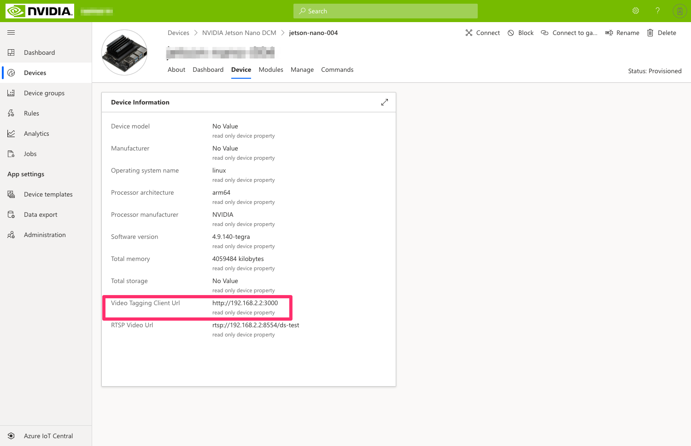

# Setting up an IoT Central application for video analytics <!-- omit in toc -->

In the previous step, we've done the initial setup of the device that Fabrikam plans on using to monitor their soda can production lines at the edge. As part of this setup, we've installed Azure IoT Edge, so now is a good time to setup its cloud counterpart, so that we have a solution for remotely managing our edge device and its workloads.

## Learning goals <!-- omit in toc -->

- How to create an Azure IoT Central application.
- How to configure Azure IoT Central for managing IoT Edge devices.

## Steps <!-- omit in toc -->

- [Create a new IoT Central application](#create-a-new-iot-central-application)
  - [Option 1: Setting up a new IoT Central application from scratch](#option-1-setting-up-a-new-iot-central-application-from-scratch)
  - [Option 2: Using a pre-built template](#option-2-using-a-pre-built-template)
- [Create an IoT Edge device from your IoT Central app](#create-an-iot-edge-device-from-your-iot-central-app)
- [Provisioning your NVIDIA Jetson Nano / IoT Edge device](#provisioning-your-nvidia-jetson-nano--iot-edge-device)
- [Testing that everything works](#testing-that-everything-works)

### Create a new IoT Central application

Fabrikam is interested in having a management portal that would allow them to remotely monitor what's happening on their production lines (for example, to determine and track an anomaly rate based on the number of cans that tip over per minute). They are also interested in the ability to reconfigure their equipment over the air, for example to use an improved computer vision model for better anomaly detection.

They plan on using [Azure IoT Central](http://azureiotcentral.com/) for implementing the aforementioned monitoring and dashboarding capabilities.

Depending on how much knowledge you want to gain about IoT Central during this workshop, two options are being offered to you. Note that they are mutually exclusive so if you decide you want to learn how to setup your IoT Central application from scratch, you should skip the instructions related to the use of a pre-built template! The first option involves setting up your IoT Central application from scratch, while the second option invites you to create a new IoT Central application from an existing template.

#### Option 1: Setting up a new IoT Central application from scratch

TODO.

#### Option 2: Using a pre-built template

If you want to start from a pre-built template of IoT Central, which already includes the device capability model and IoT Edge deployment manifest for the video analytics solution running on the NVIDIA Jetson Nano, you can go through the steps below.

- Go to [https://apps.azureiotcentral.com/build/new/af1fe1b4-d92e-45fc-9d1f-ea4decdc961d](https://apps.azureiotcentral.com/build/new/af1fe1b4-d92e-45fc-9d1f-ea4decdc961d).
- Give a name and URL to your application.
- Select your Azure subscription (you can opt-in for a 7-day free trial).
- Select your location.
- Click on `Create`.

### Create an IoT Edge device from your IoT Central app

Now that Fabrikam have their own IoT Central application, and that this application contains the capability model for the device (Jetson Nano) and set of modules (Deepstream, remote configuration module, etc.) that we want to manage, we need to create the corresponding edge device in IoT Central.

- Go to the `Devices` tab.
- Select the `NVIDIA Jetson Nano DCM` device template.
- Click on `New`.
- Give a name to your device by editing the `Device ID` and the `Device name` (human-readable name for your device) fields. We recommend you use the same name for both of these fields in this workshop.
- Click on `Create`.
- Click on your new device.
- Click on the `Connect` button in the top right corner.
- Copy your `ID Scope` value, `Device ID` value and `Primary key` value and save them for later.

### Provisioning your NVIDIA Jetson Nano / IoT Edge device

There are [several ways for an IoT Edge runtime to connect to Azure IoT](https://docs.microsoft.com/azure/iot-edge/how-to-install-iot-edge-linux#configure-the-security-daemon), and the provisioning of the device could be done manually (using an IoT Hub device connection string), or through the Azure Device Provisioning Service (DPS).

Since IoT Central leverages DPS to help with simplifying device provisioning, we are going to edit or IoT Edge configuration file accordingly and enter the information needed for our Jetson Nano device to attach to our newly created IoT Central applciation.

1. Use your favorite text editor to edit IoT Edge configuration file:

    ```bash
    sudo nano /etc/iotedge/config.yaml
    ```

2. Comment out the "`Manual provisioning configuration`" section so it looks like this:

    ```bash
    # Manual provisioning configuration
    #provisioning:
    #  source: "manual"
    #  device_connection_string: ""
    ```

3. Uncomment the "`DPS symmetric key provisioning configuration`" section, and set your IoT Central application's ID Scope (`scope_id`), Device ID (`registration_id`), and primary symmetric key (`symmetric_key`) to the values you've copied from IoT Central.

    ```bash
    # DPS symmetric key provisioning configuration
    provisioning:
    source: "dps"
    global_endpoint: "https://global.azure-devices-provisioning.net"
    scope_id: "<ID Scope>"
    attestation:
        method: "symmetric_key"
        registration_id: "<Device ID>"
        symmetric_key: "<Primary Key>"
    ```


    > **_NOTE:_**  
    >
    > In YAML, spaces are relevant as they are used for indentation. Make sure you do not have remaining unnecessary trailing spaces after uncommenting the lines above.

4. Save and exit your editor (Ctrl+O, Ctrl+X).

5. Now Restart the Azure IoT Edge runtime with the following command:

    ```bash
    sudo systemctl restart iotedge
    ```

- After a few moments the Edge runtime restarts and establishes a connection with your IoT Central application.

    > **_NOTE:_**  
    >
    > The first time that you connect your IoT Edge device to IoT Central, it will take time to start the entire solution since it first needs to download ~1.5GB of IoT Edge modules.

### Testing that everything works

After a few minutes, DeepStream should have had enough time to start the default video pipeline, called `Demo mode` in IoT Central UI. Let's see how it looks like:

1. In IoT Central, copy the `RTSP Video URL` from the `Device` tab.  
  
2. Open VLC and go to `Media` > `Open Network Stream` and paste the `RTSP Video URL` copied above as the network URL and click `Play`.
3. In IoT Central, go to to the `Dashboard` tab.
4. Verify that active telemetry is being sent by the device to IoT Central. In particular, the number of primary detections which are set to `car` by default should map to the objects detected by the 4 cameras.

At this point, you should see 4 real-time video streams being processed to detect cars and people with a Resnet 10 AI model.

<p style="text-align:center;"></p>

## Going further <!-- omit in toc -->

If you want to learn more on how to connect Azure IoT Edge devices to IoT Central, you may be interested in this [general introduction](https://docs.microsoft.com/en-us/azure/iot-central/core/concepts-iot-edge) as well as [this tutorial](https://docs.microsoft.com/en-us/azure/iot-central/core/tutorial-add-edge-as-leaf-device).

## Wrap-up and Next steps <!-- omit in toc -->

We now have provisioned our Jetson Nano device to IoT Central and, upon its first connection, IoT Edge modules have been remotely rolled out and started in the IoT Edge runtime, leaving us with a functioning (albeit not very useful for Fabrikam) computer vision application.

In the [next section](../step-003-remotely-operating/) we will be using IoT Central to remotely reconfigure the application running at the edge, from the current state where it's running demonstration video streams, to using our own video streams (ex. from our smartphone). In a later step, we'll even deploy our own custom vision model -- all of this happening fully over-the-air!