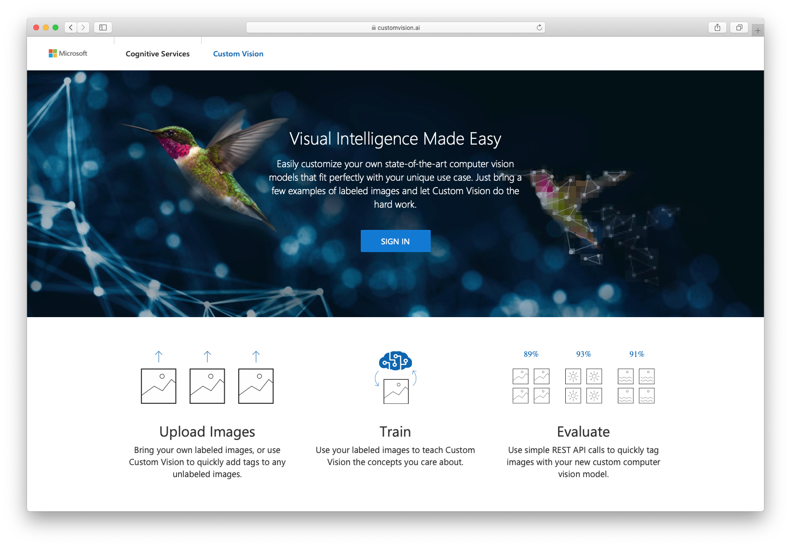
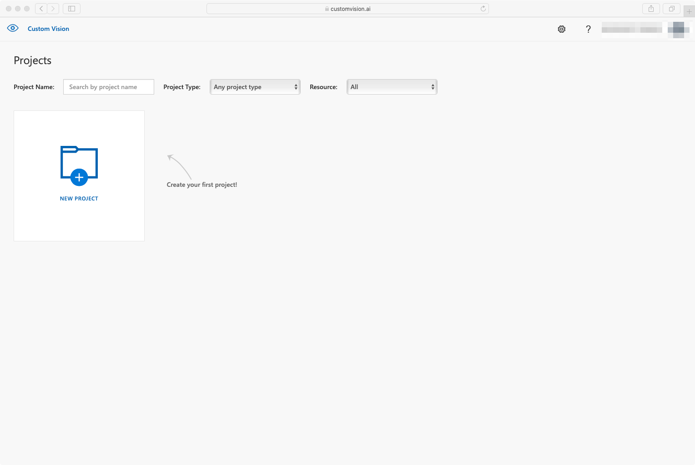
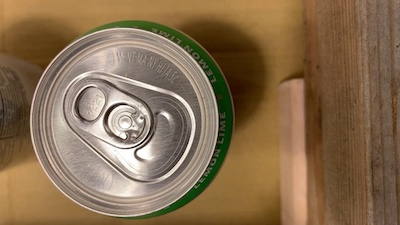
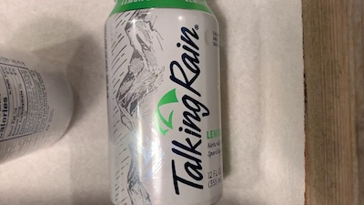
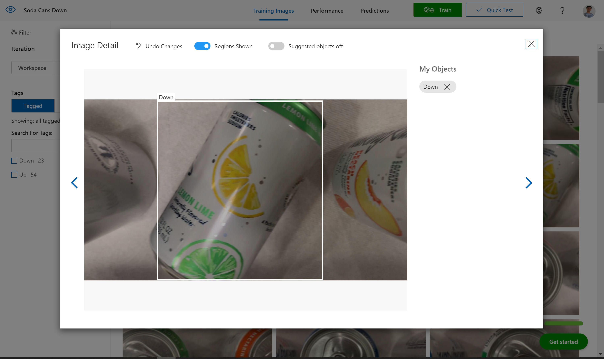

# Training and deploying a custom AI model for detecting visual anomalies <!-- omit in toc -->

Fabrikam wants to improve the efficiency of their soda can manufacturing plant. They would like to be able to identify and eliminate soda cans that fell down on their production lines in order to avoid slow downs.

In the section below we will be re-configuring the application already running on our Jetson Nano so that it runs a computer vision model that makes sense for Fabrikam's business. We will collect sample images from the production lines (some with the cans in the proper upright position, some with misplaced cans) and build a custom AI model able to determine whether cans are upright or not. We will then deploy this custom AI model to DeepStream using IoT Central. There are many ways to train a computer vision model, but one can get an accurate model very quickly, without writing a single line of code, using the online [Custom Vision service](https://www.customvision.ai/). That's what you will be using in this section of the workshop.

## Learning goals <!-- omit in toc -->

- How to quickly and simply train a custom vision model using [customvision.ai](https://customvision.ai).
- How to deploy the newly trained custom vision model at the edge.

## Steps <!-- omit in toc -->

- [Creating a new Custom Vision project](#creating-a-new-custom-vision-project)
- [Capturing a training dataset](#capturing-a-training-dataset)
- [Labelling a training dataset](#labelling-a-training-dataset)
- [Deploying a trained model](#deploying-a-trained-model)

### Creating a new Custom Vision project

Let's start by creating a new Custom Vision project in your Azure subscription. This will allow us to upload and tag the images we want to use for training our model, and to actually train the model using computing resources in the cloud. 

- Go to [http://customvision.ai](https://www.customvision.ai/) and sign in.  
  
- Create a new project.  
  
- Give it a name like `Soda Cans Down`
- Pick up your resource, if none select `create new` and select `SKU - F0` or (S0)
- Select `Project Type` = `Object Detection`
- Select `Domains` = `General (Compact)`

### Capturing a training dataset

We then need to collect images to build a custom AI model. In a real-life scenario, you would capture a (large) series of images from the cameras that are setup in the production line in order to establish your training dataset. However, in the context of this workshop and in the interest of time, [here](https://1drv.ms/u/s!AEzLzaBpSgoMo-1l) is a set of images that have already been captured for you that you can directly upload to Custom Vision. 

- [Download](https://1drv.ms/u/s!AEzLzaBpSgoMo-1l) the dataset.
- Unzip it on your computer.
- Upload all the images from the uncompressed folder into your Custom Vision project.

### Labelling a training dataset

Now that all the training images have been imported in the Custom Vision project, it is time to label them, i.e. to flag which area(s) of each image correspond to what visual feature we're interesting in identifying. 

|   |  |
|------------------------------------------------------------------------|-----------------------------------------------------------------------|
| A can to be labelled as "Up"                                           | A can to be labelled as "Down"                                        |

- Click on an image.
- Label the cans that are up as `Up` and the ones that are down as... `Down`.
- Hit the right arrow to move on to the next image and label the remaining 70+ images...or read below to use a pre-built one with this set of images  
  .
- Once you're done labeling, click on `Train`.
- To export it, go to the `Performance` tab, click on `Export` and choose `ONNX`.
- Right-click on the `Download` button and select `copy link address` to copy the anonymous location of a zip file of your custom model.

In the interest of time, you can later refer to [this pre-built Custom Vision model](https://onedrive.live.com/download?0C0A4A69A0CDCB4C&resid=0C0A4A69A0CDCB4C%21587636&authkey=AOCf3YsqcZM_3WM).

### Deploying a trained model

Finally, we'll deploy this custom vision model to the Jetson Nano using IoT Central. In IoT Central:

- Open the details page for your device.
- Navigate to the `Manage` tab.
- Make sure the `Demo Mode` is unchecked.
- Update the first three `Video Stream Input` to the following values (/!\ )
  - `Video Stream Input 1` > `CameraId` = `Cam01`
  - `Video Stream Input 1` > `videoStreamUrl` = `file:///data/misc/storage/sampleStreams/cam-cans-00.mp4`
  - `Video Stream Input 2` > `CameraId` = `Cam02`
  - `Video Stream Input 2` > `videoStreamUrl` = `file:///data/misc/storage/sampleStreams/cam-cans-01.mp4`
  - `Video Stream Input 3` > `CameraId` = `Cam03`
  - `Video Stream Input 3` > `videoStreamUrl` = `file:///data/misc/storage/sampleStreams/cam-cans-02.mp4`  
- Select `Custom Vision` as the `AI model Type`
- Paste the URI of your custom vision model in the `Custom Vision Model Url`, for instance `https://onedrive.live.com/download?0C0A4A69A0CDCB4C&resid=0C0A4A69A0CDCB4C%21587636&authkey=AOCf3YsqcZM_3WM` for the pre-built one.
- Update the detection classes:
  -  `Primary Detection Class` = `Up`
  - `Secondary Detection Class` = `Down`
- Hit `Save`

After a few moments, the `deepstream` module should restart. Once it is in `Running` state again, look at the output RTSP stream via VLC (`Media` > `Open Network Stream` > paste the `RTSP Video URL` that you got from the IoT Central's `Device` tab > `Play`).

We are now visualizing the processing of 3 real time (e.g. 30fps 1080p) video feeds with a custom vision AI models that we built in minutes to detect visual anomalies!

## Going further <!-- omit in toc -->

You can take a few minutes to train an entirely different model using [customvision.ai](https://customvision.ai), and deploy it on the fly to your running 

## Wrap-up and Next steps <!-- omit in toc -->

In the [next section](../step-step-005-sending-alerts/) we will implement the final remaining step to provide Fabrikam with a minimum viable product: the ability to trigger custom rules and alerts when incidents on the production lines are detected.