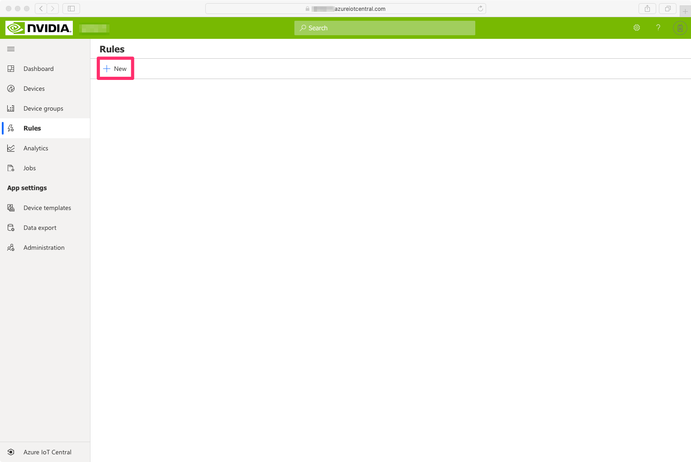
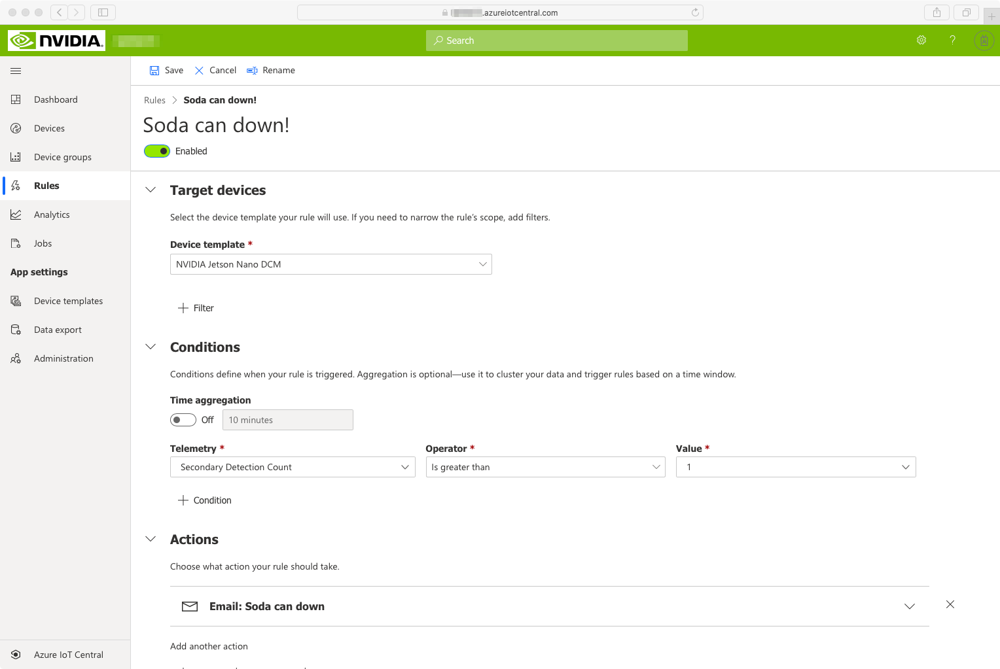

# Sending alerts <!-- omit in toc -->

To be alerted as soon as a soda can is down, we'll set up an alert to send an email whenever a new soda can is detected as being down.

Using IoT Central, you can easily define rules and alerts based on the telemetry received by IoT Central. Let's create one whenever a soda can is down.

## Learning goals <!-- omit in toc -->

- How to use IoT Central's built-in rules engine to implement real-time alerts.
 
## Steps <!-- omit in toc -->

* [Creating an alert](#creating-an-alert)
* [Cleaning up resources](#cleaning-up-resources)

### Creating an alert

1. In your IoT Central application, navigate to the `Rules` tab in the navigation menu on the left, and click `New` to create a new rule.  
  
2. Give it a name like `Soda can down!`
3. Select your device template `NVIDIA Jetson Nano DCM`
4. Create a Condition with the following attributes:
   - Telemetry = `Secondary Detection Count`
   - Operator = `Is greater than`
   - Value = `1` and hit Enter
5. Create an `email` Action with the following attributes:
   - Display name = `Soda can down`
   - To = your email address used to login to your IoT Central application
   - hit `Done`  
6. Your configured rule should be similar to the screen capture below. Hit `Save` to save it.
  

Since the video streams you've configured in the previous steps contain a few cans that are tipped over, you should start receiving emails shortly!

### Cleaning up resources

#### IoT Central <!-- omit in toc -->

Although your IoT Central application would probably not cost you anything, you may want to delete it now that you've completed this workshop.

From your web browser:

- Go to your IoT Central application.
- Click on the `Administration` tab from the navigation menu on the left.
- Click on `Delete the application` and confirm.

#### IoT Edge <!-- omit in toc -->

If you'd like to uninstall Azure IoT Edge and all its associated containers, you can run the following commands on the Jetson Nano from an SSH terminal:

  ```bash
  sudo apt-get remove --purge iotedge
  sudo rm -r /data
  ```

## Going further <!-- omit in toc -->

In a real-life scenario, Fabrikam likely has an existing process in place for dealing with anomalies on the production line. 

For example, their quality assurance policy mandates that every incident is properly logged in their PLM (Product Lifecycle Management) system, and they have escalation workflows in place to make sure anomalies are properly acted upon. 

You may be interested in checking out some of the following resources available online to get familiar with how Fabrikam could leverage Connected Field Service for Microsoft Dynamics 365:

- [Working with Connected Field Service for Dynamics 365 and Azure IoT](https://docs.microsoft.com/en-us/learn/paths/working-with-connected-field-service-iot/) learning path on Microsoft Learn.
- [Connected Field Service for Azure IoT Central](https://docs.microsoft.com/en-us/dynamics365/field-service/cfs-iot-overview).

Finally, there are other resources that you can check out if you want to keep exploring how to make the most of your NVIDIA Jetson Nano device using Azure and other Microsoft technologies. See [http://aka.ms/jetson-on-azure](http://aka.ms/jetson-on-azure).